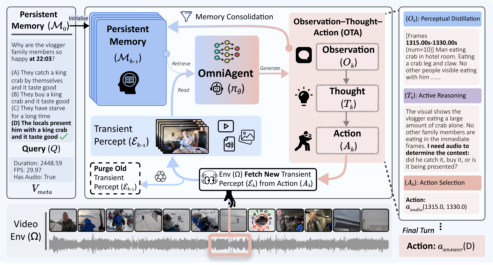
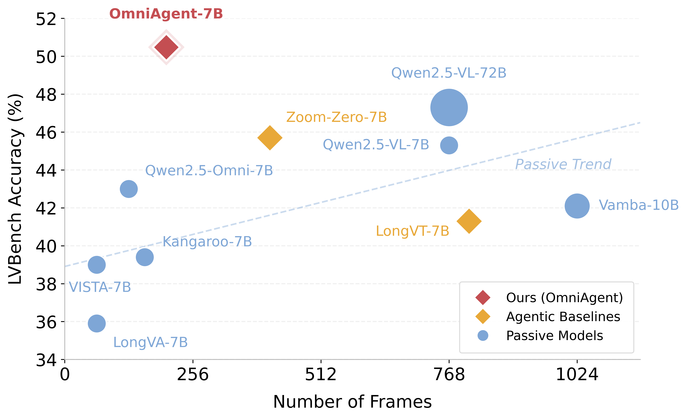
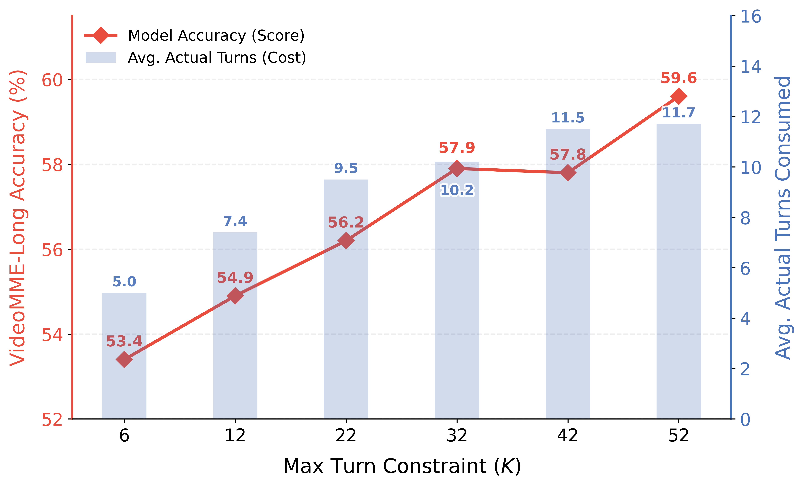

# OmniAgent: Native Active Perception as Reasoning for Omni-Modal Understanding

<p align="center">
  <a href="#citation"></a>
  <!-- <a href="#"></a> -->
  <a href="https://huggingface.co/harryhsing/OmniAgent-RL-7B"></a>
  <a href="https://huggingface.co/harryhsing/OmniAgent-SFT-7B"></a>
</p>

<p align="center">
  
</p>

> **OmniAgent** is the first native omni-modal agent for active perception in video understanding. It treats perception as reasoning, iteratively observing, thinking, and acting through on-demand `get_frames`, `get_audio`, and `get_clip` actions instead of consuming every frame upfront.

---

## News

- **2026-06**: Released OmniAgent code, RL/SFT checkpoints, example data formats, and the public SFT recipe.
- **2026-06**: Paper and arXiv links are coming soon.

---

## Overview

Long video and omni-modal understanding often require targeted evidence rather than dense, uniform consumption of every frame. Passive "watch-it-all" models spend context on irrelevant frames, while many interactive frameworks still rely on global pre-scanning, which keeps context cost tied to video length, or delegate multimodal perception to external modules, leaving perception and reasoning split across components.

OmniAgent formulates audio-visual exploration as a POMDP-based iterative Observation-Thought-Action (OTA) cycle. At each turn, the model distills the transient multimodal percept into persistent textual memory, reasons over the accumulated evidence, and chooses one structured action from `get_frames`, `get_audio`, `get_clip`, or `answer`.

Through memory consolidation, raw media is purged from the active context after it is summarized, so the reasoning trace depends on information need rather than raw video duration. The environment only extracts frames, audio, or clips; all semantic perception, reasoning, and action selection are performed by the same native omni model.

OmniAgent is trained with Agentic SFT and Agentic RL. TAURA provides turn-aware, entropy-steered credit assignment so long-horizon perception decisions can be optimized beyond final-answer supervision.

---

## Why Active Perception?

- **Passive dense sampling** wastes context on evidence that may be irrelevant to the query.
- **Global pre-scan agents** still pay an upfront video-length cost before deciding where to look.
- **OmniAgent searches query-conditionally**, preserving only distilled textual evidence while requesting raw media on demand.

---

## Highlights

- **First native omni-modal agent for active perception**: to our knowledge, OmniAgent is the first end-to-end native agentic framework that unifies perception, reasoning, and action in one omni-modal model for video tasks.
- **Native active perception**: OmniAgent chooses what evidence to inspect next through an Observation-Thought-Action cycle.
- **Omni-modal reasoning**: video, audio, and text are handled jointly, with audio used as a temporal anchor for visual inspection.
- **Single native model, not tool orchestration**: the environment returns raw frames, audio, or clips; OmniAgent performs semantic perception and reasoning itself.
- **TAURA**: turn-level entropy rescales trajectory advantages to credit pivotal discovery turns over trivial actions.
- **Test-time scaling**: increasing the reasoning budget improves accuracy while the actual number of turns saturates adaptively.

### Training at a Glance

- **Agentic SFT**: 58K synthetic trajectories generated through best-of-N exploration with self-correction.
- **Dual-stage quality control**: outcome verification filters for task success, while rationality auditing filters unsupported reasoning traces.
- **Agentic RL with TAURA**: turn-level entropy mitigates advantage homogenization by assigning more credit to pivotal discovery turns.
- **Public recipe**: the sanitized final SFT configuration is released at [recipe/sft_agent_final.yaml](recipe/sft_agent_final.yaml).

---

## Results

<table>
<tr>
<td width="50%">

**LVBench efficiency**

OmniAgent-7B outperforms Qwen2.5-VL-72B while using about 73% fewer frames (203 vs. 768).



</td>
<td width="50%">

**VideoMME-Long scaling**

Accuracy improves by +6.2% as the max turn budget increases, while actual turns saturate at about 11.7.



</td>
</tr>
</table>

### Results at a glance

<table width="99%" style="border-collapse: collapse;">
<colgroup>
<col width="15%">
<col width="22%">
<col width="12%">
<col width="8%">
<col width="17%">
<col width="17%">
<col width="9%">
</colgroup>
<thead>
<tr>
<th style="text-align: left; white-space: nowrap;">Task</th>
<th style="text-align: left; white-space: nowrap;">Benchmark</th>
<th style="text-align: center; white-space: nowrap;">Duration</th>
<th style="text-align: center; white-space: nowrap;">Metric</th>
<th style="text-align: center; white-space: nowrap;">Qwen2.5-Omni-7B</th>
<th style="text-align: center; white-space: nowrap;">OmniAgent-7B</th>
<th style="text-align: center; white-space: nowrap;">Δ</th>
</tr>
</thead>
<tbody>
<tr>
<td rowspan="6" style="text-align: left; vertical-align: middle; white-space: nowrap;"><strong>Video Understanding</strong></td>
<td style="text-align: left; white-space: nowrap;">VideoMME (Overall)</td>
<td style="text-align: center; white-space: nowrap;">1–60 min</td>
<td style="text-align: center;">AVG</td>
<td style="text-align: center;">64.8</td>
<td style="text-align: center;"><strong>67.8</strong></td>
<td style="text-align: center;">+3.0</td>
</tr>
<tr>
<td style="text-align: left; white-space: nowrap;">VideoMME (Long)</td>
<td style="text-align: center; white-space: nowrap;">30–60 min</td>
<td style="text-align: center;">AVG</td>
<td style="text-align: center;">54.8</td>
<td style="text-align: center;"><strong>59.6</strong></td>
<td style="text-align: center;">+4.8</td>
</tr>
<tr>
<td style="text-align: left; white-space: nowrap;">VSI-Bench</td>
<td style="text-align: center; white-space: nowrap;">1m 37s</td>
<td style="text-align: center;">AVG</td>
<td style="text-align: center;">35.5</td>
<td style="text-align: center;"><strong>48.4</strong></td>
<td style="text-align: center;">+12.9</td>
</tr>
<tr>
<td style="text-align: left; white-space: nowrap;">MLVU</td>
<td style="text-align: center; white-space: nowrap;">3–120 min</td>
<td style="text-align: center;">M-AVG</td>
<td style="text-align: center;">65.2</td>
<td style="text-align: center;"><strong>71.1</strong></td>
<td style="text-align: center;">+5.9</td>
</tr>
<tr>
<td style="text-align: left; white-space: nowrap;">Minerva</td>
<td style="text-align: center; white-space: nowrap;">2–90 min</td>
<td style="text-align: center;">AVG</td>
<td style="text-align: center;">33.4</td>
<td style="text-align: center;"><strong>41.4</strong></td>
<td style="text-align: center;">+8.0</td>
</tr>
<tr>
<td style="text-align: left; white-space: nowrap;">LVBench</td>
<td style="text-align: center; white-space: nowrap;">1h 8m</td>
<td style="text-align: center;">AVG</td>
<td style="text-align: center;">43.0</td>
<td style="text-align: center;"><strong>50.5</strong></td>
<td style="text-align: center;">+7.5</td>
</tr>
<tr>
<td rowspan="3" style="text-align: left; vertical-align: middle; white-space: nowrap;"><strong>Audio-Visual Understanding</strong></td>
<td style="text-align: left; white-space: nowrap;">DailyOmni</td>
<td style="text-align: center; white-space: nowrap;">43s</td>
<td style="text-align: center;">AVG</td>
<td style="text-align: center;">60.1</td>
<td style="text-align: center;"><strong>64.8</strong></td>
<td style="text-align: center;">+4.7</td>
</tr>
<tr>
<td style="text-align: left; white-space: nowrap;">WorldSense</td>
<td style="text-align: center; white-space: nowrap;">2m 21s</td>
<td style="text-align: center;">AVG</td>
<td style="text-align: center;">45.4</td>
<td style="text-align: center;"><strong>47.2</strong></td>
<td style="text-align: center;">+1.8</td>
</tr>
<tr>
<td style="text-align: left; white-space: nowrap;">OmniVideoBench</td>
<td style="text-align: center; white-space: nowrap;">6m 24s</td>
<td style="text-align: center;">AVG</td>
<td style="text-align: center;">29.3</td>
<td style="text-align: center;"><strong>37.1</strong></td>
<td style="text-align: center;">+7.8</td>
</tr>
<tr>
<td rowspan="3" style="text-align: left; vertical-align: middle; white-space: nowrap;"><strong>Temporal Grounding</strong></td>
<td style="text-align: left; white-space: nowrap;">LongVALE</td>
<td style="text-align: center; white-space: nowrap;">3m 53s</td>
<td style="text-align: center;">IoU</td>
<td style="text-align: center;">5.7</td>
<td style="text-align: center;"><strong>39.1</strong></td>
<td style="text-align: center;">+33.4</td>
</tr>
<tr>
<td style="text-align: left; white-space: nowrap;">VUE-TR (Vision+Audio)</td>
<td style="text-align: center; white-space: nowrap;">17m 46s</td>
<td style="text-align: center;">IoU</td>
<td style="text-align: center;">3.5</td>
<td style="text-align: center;"><strong>36.5</strong></td>
<td style="text-align: center;">+33.0</td>
</tr>
<tr>
<td style="text-align: left; white-space: nowrap;">VUE-TR (Vision)</td>
<td style="text-align: center; white-space: nowrap;">18m 34s</td>
<td style="text-align: center;">IoU</td>
<td style="text-align: center;">8.0</td>
<td style="text-align: center;"><strong>46.1</strong></td>
<td style="text-align: center;">+38.1</td>
</tr>
</tbody>
</table>


Key takeaways:

- **Parameter and frame efficiency**: OmniAgent-7B outperforms Qwen2.5-VL-72B on LVBench (50.5 vs. 47.3) while using about 73% fewer frames.
- **Temporal grounding**: OmniAgent improves over Qwen2.5-Omni-7B by +33.4 on LongVALE and +33.0 on VUE-TR (Vision+Audio).
- **Audio-visual reasoning**: OmniAgent improves over Qwen2.5-Omni-7B by +4.7 on DailyOmni and +7.8 on OmniVideo.
- **Positive test-time scaling**: VideoMME-Long improves by +6.2 as the reasoning-turn budget increases.

---

## Resources

- **Paper**: coming soon
- **arXiv**: coming soon
- **Models**: [OmniAgent-RL-7B](https://huggingface.co/harryhsing/OmniAgent-RL-7B), [OmniAgent-SFT-7B](https://huggingface.co/harryhsing/OmniAgent-SFT-7B)
- **Recipe**: [SFT recipe](recipe/sft_agent_final.yaml)
- **Examples**: [data/](data/) and [assets/](assets/)
- **Entry points**: [demo/](demo/) for inference, evaluation, and web demo; [examples/omniagent_train/](examples/omniagent_train/) for RL training

---

## Requirements

| Item | Recommended |
|------|-------------|
| Python | 3.11 |
| GPU | 1x A100 80GB for inference or single-sample eval; 8x A100 80GB for faster batch eval; 64x A100 80GB+ for training |
| System tools | CUDA 12.6 toolchain, `ffmpeg` |

Single-GPU evaluation is supported, but throughput is lower.

---

## Installation

```bash
conda create -n omniagent python=3.11 -y
conda activate omniagent

pip install -U "setuptools<81"
pip install torch==2.7.0 --index-url https://download.pytorch.org/whl/cu126
pip install flash-attn==2.7.4.post1 --no-build-isolation
pip install -r requirements.txt

pip install -e qwen-vl-utils/
pip install -e qwen-omni-utils/
pip install -e .
```

If `flash-attn` fails to build, make sure the CUDA toolkit matches the PyTorch CUDA build. For CUDA 12.6:

```bash
export CUDA_HOME=/usr/local/cuda-12.6
```

Verify the local packages:

```bash
python -c "import verl; import vllm; import flash_attn; print('All imports OK')"
```

Download the released checkpoint from Hugging Face and place or symlink it as `checkpoints/OmniAgent-RL-7B` for the examples below.

---

## Quick Start

### Single-Sample Inference

```bash
bash demo/launch_inference.sh checkpoints/OmniAgent-RL-7B assets/example_video_mcq.mp4
```

The script accepts environment variables for the question, answer, and question type:

```bash
MODEL_PATH=checkpoints/OmniAgent-RL-7B \
VIDEO_PATH=assets/example_video_mcq.mp4 \
QUESTION='Who or what lauds "Immigrant Diaries" as "A SURE FIRE HIT", according to the video?' \
QUESTION_TYPE=MCQ \
OPTIONS="A. Remote Goat.\nB. The New York Times.\nC. Variety.\nD. IndieWire." \
ANSWER="A" \
  bash demo/launch_inference.sh
```

### Web Demo

```bash
bash demo/launch_demo.sh checkpoints/OmniAgent-RL-7B
```

The demo starts at `http://localhost:7862` by default. It supports built-in examples and uploaded videos directly.

Useful runtime overrides:

```bash
MODEL_PATH=checkpoints/OmniAgent-RL-7B PORT=8080 TENSOR_PARALLEL=2 GPU_MEMORY_UTIL=0.8 \
  bash demo/launch_demo.sh
```

### Batch Evaluation

```bash
GPU_IDS=0,1,2,3 \
MODEL_PATH=checkpoints/OmniAgent-RL-7B \
DATASET_JSONL=/path/to/dataset.jsonl \
  bash demo/launch_eval.sh
```

The launcher writes `results.jsonl`, `summary.json`, `summary.csv`, and logs under `eval_output/`. See [data/example_eval.jsonl](data/example_eval.jsonl) for the expected schema.

---

## Data Format

Evaluation and inference use one JSON object per line:

```json
{
  "video": "videos/Video-MME/lMxFbRc3Luk.mp4",
  "question_type": "MCQ",
  "question": "As depicted in the video, why is the teacher still in the museum after the security alarm?",
  "options": ["A. She wants to steal the crown.", "B. She checks the security.", "C. She comes to find her students.", "D. She has a talk with the girl and the boy."],
  "answer": "A"
}
```

Supported answer formats:

| Type | Answer format | Example |
|------|---------------|---------|
| `MCQ` | single uppercase letter | `"A"` |
| `TR` | one or more temporal spans | `"[[42.5, 47.8]]"` |
| `FF` | free-form text | `"White"` |
| `NUM` / `SIZE` | numeric string | `"4"` |

RL training data extends the same fields with video metadata and trajectory metadata:

```json
{
  "prompt": [{"content": "", "role": "user"}],
  "question_type": "MCQ_LongVR-Short",
  "question": "Based on the video, what is the most likely primary intention behind ...",
  "answer": "B",
  "options": ["A. ...", "B. ...", "C. ...", "D. ..."],
  "video": "videos/LongVideo-Reason/3WYfzz8_lQs.mp4",
  "fps": 29.97,
  "duration_seconds": 287.23,
  "has_audio": true,
  "data_source": "agent",
  "ability": "agent",
  "extra_info": {"traj_id": "8a049033-...", "error_reason": "LOGIC_WRONG_ANSWER"}
}
```

SFT data stores complete multi-turn trajectories. Each line is one step of a trajectory and contains `raw_input`, the assistant `output`, step-level reward metadata, and the final `episode_reward`.

Example files:

| File | Description |
|------|-------------|
| [data/example_eval.jsonl](data/example_eval.jsonl) | Evaluation schema examples |
| [data/example_train_rl.jsonl](data/example_train_rl.jsonl) | RL training format examples |
| [data/example_train_sft.jsonl](data/example_train_sft.jsonl) | SFT trajectory format examples |
| [assets/example_video_mcq.mp4](assets/example_video_mcq.mp4) | MCQ demo video |
| [assets/example_video_tr.mp4](assets/example_video_tr.mp4) | Temporal grounding demo video |
| [assets/example_video_ff.mp4](assets/example_video_ff.mp4) | Free-form demo video |

---

## Training

### TAURA

```bash
TRAIN_FILE=/path/to/train_data.jsonl \
VAL_FILE=/path/to/val_data.jsonl \
MODEL_BASE_PATH=/path/to/models \
  bash examples/omniagent_train/train_TAURA.sh
```

### GRPO Baseline

```bash
TRAIN_FILE=/path/to/train_data.jsonl \
VAL_FILE=/path/to/val_data.jsonl \
MODEL_BASE_PATH=/path/to/models \
  bash examples/omniagent_train/train_GRPO.sh
```

Use dry run mode to verify paths and launch configuration:

```bash
DRY_RUN=1 bash examples/omniagent_train/train_TAURA.sh
```

Key training knobs:

| Variable | Default | Description |
|----------|---------|-------------|
| `TRAIN_FILE` | `/path/to/train_data.jsonl` | Training JSONL |
| `VAL_FILE` | `/path/to/val_data.jsonl` | Validation JSONL |
| `MODEL_BASE_PATH` | `/path/to/models` | Directory containing `OmniAgent-SFT-7B` |
| `MICRO_RATIO` | `4` | Samples per GPU for vLLM rollout |
| `USE_DYNAMIC_STEP` | `True` | Enable duration-adaptive step limit |
| `MIN_MAX_STEPS` | `5` | Dynamic step lower bound |
| `WANDB_API_KEY` | empty | Optional experiment tracking |

The training scripts support multi-node Ray launch through common cluster environment variables such as `WORLD_SIZE`, `RANK`, `MASTER_ADDR`, and `MASTER_PORT`.

---

## Test-Time Scaling

OmniAgent can spend more reasoning turns at inference time. With `USE_DYNAMIC_STEP=true`, the effective step budget adapts to video duration:

```text
effective_max_steps = min(MIN_MAX_STEPS + int(duration / max_clip_len), MAX_STEPS)
```

For the paper setting, scaling the max turn budget from 6 to 52 improves VideoMME-Long accuracy by +6.2%, while the actual number of turns saturates around 11.7.

On LVBench, average turns grow only mildly from 8.5 to 12.5 as videos become much longer, while turns per hour drops sharply. This indicates that compute follows information need rather than video duration.

To run a simple scaling sweep:

```bash
for steps in 12 22 32 42 52; do
  MAX_STEPS=$steps GPU_IDS=0,1,2,3 MODEL_PATH=checkpoints/OmniAgent-RL-7B \
  DATASET_JSONL=/path/to/dataset.jsonl bash demo/launch_eval.sh
done
```

---

## Reward System

OmniAgent uses question-type-specific rewards:

| Type | Reward | External API |
|------|--------|--------------|
| `MCQ` | exact match on option letter | No |
| `TR` | temporal IoU | No |
| `FF` | LLM-as-judge semantic match | Yes, `DASHSCOPE_API_KEY` |
| `NUM` / `SIZE` | numeric relative accuracy | No |

Without `DASHSCOPE_API_KEY`, free-form (`FF`) reward defaults to `0.0`; MCQ, TR, NUM, and SIZE remain usable.

Create a `.env` file if you need FF reward scoring:

```bash
DASHSCOPE_API_KEY="your-api-key-here"
```

---

## SFT Recipe and Preprocessing

The public cold-start SFT recipe is [recipe/sft_agent_final.yaml](recipe/sft_agent_final.yaml).

For data preprocessing, use the repo-local utility packages:

```bash
pip install -e qwen-omni-utils/
pip install -e qwen-vl-utils/
```

The recipe documents the parameter settings we used; it does not require a specific public trainer. Users may reproduce SFT with any compatible Qwen-Omni SFT stack. [ms-swift](https://github.com/modelscope/ms-swift) is one possible reference implementation.

For SFT data, collect multi-turn step logs with the trajectory collection utilities under `inference/`; the collection scripts write `*_steps.jsonl` next to the sample-level results JSON. Then run `inference/results_final_v1/filter_and_export_sft.py` to clean those trajectories and export training-ready JSONL. See [inference/parallel_eval_usage.md](inference/parallel_eval_usage.md) for the command flow.

---

## FAQ and Troubleshooting

**What should I put in `DATASET_JSONL`?**

Prepare a local JSONL file following the schema in [data/example_eval.jsonl](data/example_eval.jsonl), and point each `video` field to a video path available in your environment.

**Can I run evaluation on one GPU?**

Yes. Single-GPU evaluation is supported, but batch throughput is lower. We recommend 8x A100 80GB for faster batch evaluation.

**Why is FF reward always `0.0`?**

Free-form (`FF`) reward uses an LLM judge. Set `DASHSCOPE_API_KEY` in `.env` to enable it. MCQ, TR, NUM, and SIZE scoring do not require this key.

**Is OmniAgent a tool-using system?**

No. The environment only returns raw media segments. OmniAgent itself performs semantic perception, reasoning, and action selection.

**Why does the README call OmniAgent "first"?**

The paper positions OmniAgent as the first native omni-modal agent for POMDP-based active perception, and as the first end-to-end native agentic framework that unifies perception, reasoning, and action in one model for omni-modal video tasks.

**Do I need Qwen-Omni talker weights for SFT?**

OmniAgent uses the Qwen-Omni thinker path for agent reasoning. Audio-output / talker weights are not required for the OmniAgent reasoning loop unless your SFT framework expects the full upstream checkpoint layout.

**Can the web demo use uploaded videos directly?**

Yes. The web demo supports built-in examples and uploaded local videos directly.

| Issue | Fix |
|-------|-----|
| `flash-attn` build fails | Set `CUDA_HOME=/usr/local/cuda-12.6` and rebuild |
| `CUDA out of memory` | Lower `GPU_MEMORY_UTIL` or increase tensor parallelism |
| `ModuleNotFoundError: verl` | Run `pip install -e .` from the repo root |
| Port `7862` already in use | Stop the old demo process or let `AUTO_KILL=true` handle it |
| FF rewards stay at `0.0` | Set `DASHSCOPE_API_KEY` in `.env` |
| Training OOM | Reduce `MICRO_RATIO` or use more GPUs |

---

## Acknowledgement

We thank the authors of [verl](https://github.com/volcengine/verl) and [verl-agent](https://github.com/langfengq/verl-agent) for their foundational infrastructure. OmniAgent substantially builds upon and redesigns these codebases to enable native active perception for omni-modal understanding.

## Citation

```bibtex
@inproceedings{xing2026omniagent,
  title={Native Active Perception as Reasoning for Omni-Modal Understanding},
  author={Zhenghao Xing and Ruiyang Xu and Yuxuan Wang and Jinzheng He and Ziyang Ma and Qize Yang and Yunfei Chu and Jin Xu and Junyang Lin and Chi-Wing Fu and Pheng-Ann Heng},
  booktitle={International Conference on Machine Learning (ICML)},
  year={2026}
}
```

## License

This repository is released under the [Apache License 2.0](LICENSE).
