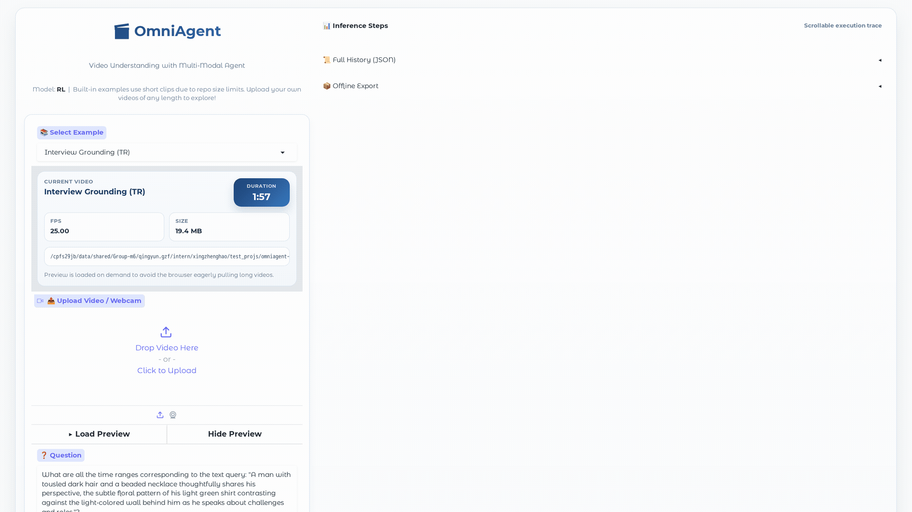

# Native Active Perception as Reasoning for Omni-Modal Understanding

<p align="center">
  <a href="#citation"></a>
  <!-- <a href="#citation"></a> -->
  <a href="https://arxiv.org/abs/2606.19341"></a>
  <a href="https://huggingface.co/harryhsing/OmniAgent-RL-7B"></a>
  <a href="https://huggingface.co/harryhsing/OmniAgent-SFT-7B"></a>
  <a href="LICENSE"></a>
</p>

<p align="center">
  
  
</p>

<p align="center">
  
</p>

> **OmniAgent** is, to our knowledge, the first native omni-modal agent for active perception in video understanding. It treats perception as reasoning — iteratively **observing, thinking, and acting** through on-demand `get_frames`, `get_audio`, and `get_clip` actions instead of consuming every frame upfront.

---

## Table of Contents

- [Native Active Perception as Reasoning for Omni-Modal Understanding](#native-active-perception-as-reasoning-for-omni-modal-understanding)
  - [Table of Contents](#table-of-contents)
  - [News](#news)
  - [Overview](#overview)
  - [Highlights](#highlights)
  - [Method](#method)
  - [Results](#results)
    - [Main results](#main-results)
    - [Efficiency and Test-Time Scaling](#efficiency-and-test-time-scaling)
  - [Resources](#resources)
  - [Demo Preview](#demo-preview)
  - [Repository Structure](#repository-structure)
  - [Requirements](#requirements)
  - [Installation](#installation)
  - [Quick Start](#quick-start)
    - [Single-sample inference](#single-sample-inference)
    - [Web demo](#web-demo)
    - [Batch evaluation](#batch-evaluation)
  - [Data Format](#data-format)
  - [Training](#training)
    - [Agentic SFT (cold start)](#agentic-sft-cold-start)
    - [Agentic RL with TAURA](#agentic-rl-with-taura)
    - [GRPO baseline](#grpo-baseline)
  - [Test-Time Scaling](#test-time-scaling)
  - [Reward Design](#reward-design)
  - [FAQ and Troubleshooting](#faq-and-troubleshooting)
  - [Acknowledgement](#acknowledgement)
  - [Citation](#citation)
  - [License](#license)

---

## News

- **ICML 2026** — *Native Active Perception as Reasoning for Omni-Modal Understanding* has been accepted to ICML 2026. 🎉
- **2026-06** — Released the OmniAgent code, RL/SFT checkpoints, example data formats, and the public SFT recipe.
- **2026-06** — Paper now available on [arXiv](https://arxiv.org/abs/2606.19341).

---

## Overview

Long-video and omni-modal understanding usually hinges on a few pieces of targeted evidence rather than dense, uniform consumption of every frame. Passive "watch-it-all" models spend their context on irrelevant frames; many interactive frameworks still rely on a global pre-scan — which keeps context cost tied to video length — or delegate perception to external modules, splitting perception and reasoning across components.

OmniAgent instead formulates audio-visual exploration as a **POMDP-based iterative Observation–Thought–Action (OTA) cycle**. At each turn the model distills the transient multimodal percept into persistent textual memory, reasons over the accumulated evidence, and chooses a single structured action from `get_frames`, `get_audio`, `get_clip`, or `answer`. Through **memory consolidation**, raw media is purged from the active context once it has been summarized, so the reasoning trace scales with *information need* rather than raw video duration. Crucially, the environment only extracts frames, audio, or clips — all semantic perception, reasoning, and action selection are performed by the **same native omni model**.

OmniAgent is trained in two stages: **Agentic SFT** for cold-start exploration, then **Agentic RL** with **TAURA**, which provides turn-aware, entropy-steered credit assignment so long-horizon perception decisions can be optimized beyond final-answer supervision.

---

## Highlights

- **First native omni-modal agent for active perception** — to our knowledge, the first end-to-end native omni-modal agentic framework that unifies perception, reasoning, and action in one model for video tasks.
- **Native active perception** — at each turn OmniAgent chooses what evidence to inspect next — more frames, audio, or a targeted clip — through an Observation–Thought–Action cycle, rather than consuming the whole video upfront.
- **Memory consolidation** — each percept is summarized into a persistent textual memory and the raw media is purged, decoupling context cost from video duration.
- **TAURA** — turn-level entropy rescales advantages to steer credit toward pivotal discovery turns.
- **Positive test-time scaling** — increasing the maximum turn limit improves accuracy while the actual number of turns saturates adaptively.
- **A single model, not tool orchestration** — the environment returns only raw frames, audio, or clips; OmniAgent performs all perception and reasoning itself, with no external modules.

---

## Method

OmniAgent reframes video perception as reasoning: a single omni model iteratively observes, thinks, and acts on the video through an Observation–Thought–Action (OTA) loop, with no external perception modules (see the figure above). We instantiate it on the Qwen2.5-Omni-7B base model.

**Observation–Thought–Action (OTA) cycle.** Each turn produces an *observation* (the distilled summary of the latest percept), a *thought* (reasoning over accumulated memory), and an *action*. Actions are structured calls — `get_frames`, `get_audio`, `get_clip`, or `answer` — and the environment responds only with the requested raw media.

**Memory consolidation.** After a percept is summarized into textual memory, the raw media is purged from the active context. The persistent trace therefore tracks information need, keeping context cost decoupled from video length.

**Two-stage training.**

- **Agentic SFT (cold start).** 58K synthetic trajectories generated via best-of-N exploration with self-correction. A dual-stage quality filter combines *outcome verification* (keep task-successful trajectories) with *rationality auditing* (drop trajectories with unsupported reasoning). The sanitized final recipe is released at [`recipe/sft_agent_final.yaml`](recipe/sft_agent_final.yaml).
- **Agentic RL with TAURA.** Turn-level entropy mitigates advantage homogenization by assigning more credit to pivotal discovery turns, optimizing long-horizon perception decisions beyond final-answer reward.

---

## Results

OmniAgent achieves **state-of-the-art performance among open-source models across all ten benchmarks**. We first summarize the main benchmark results across video understanding, audio-visual understanding, and temporal grounding, then highlight frame efficiency and test-time scaling behavior. See **Tables 1-3 in the paper** for the full comparison against all baselines.

### Main results

All numbers compare OmniAgent-7B against its Qwen2.5-Omni-7B base model, evaluated on the same benchmarks under the same metrics.

<table>
<thead>
<tr>
<th align="left">Task</th>
<th align="left">Benchmark</th>
<th align="center">Duration</th>
<th align="center">Metric</th>
<th align="center">Qwen2.5-Omni-7B</th>
<th align="center">OmniAgent-7B</th>
<th align="center">Δ</th>
</tr>
</thead>
<tbody>
<tr>
<td rowspan="6" align="left" valign="middle"><strong>Video Understanding</strong></td>
<td align="left">VideoMME (Overall)</td>
<td align="center">1–60 min</td>
<td align="center">AVG</td>
<td align="center">64.8</td>
<td align="center"><strong>67.8</strong></td>
<td align="center">+3.0</td>
</tr>
<tr>
<td align="left">VideoMME (Long)</td>
<td align="center">30–60 min</td>
<td align="center">AVG</td>
<td align="center">54.8</td>
<td align="center"><strong>59.6</strong></td>
<td align="center">+4.8</td>
</tr>
<tr>
<td align="left">VSI-Bench</td>
<td align="center">1m 37s</td>
<td align="center">AVG</td>
<td align="center">35.5</td>
<td align="center"><strong>48.4</strong></td>
<td align="center">+12.9</td>
</tr>
<tr>
<td align="left">MLVU</td>
<td align="center">3–120 min</td>
<td align="center">M-AVG</td>
<td align="center">65.2</td>
<td align="center"><strong>71.1</strong></td>
<td align="center">+5.9</td>
</tr>
<tr>
<td align="left">Minerva</td>
<td align="center">2–90 min</td>
<td align="center">AVG</td>
<td align="center">33.4</td>
<td align="center"><strong>41.4</strong></td>
<td align="center">+8.0</td>
</tr>
<tr>
<td align="left">LVBench</td>
<td align="center">1h 8m</td>
<td align="center">AVG</td>
<td align="center">43.0</td>
<td align="center"><strong>50.5</strong></td>
<td align="center">+7.5</td>
</tr>
<tr>
<td rowspan="3" align="left" valign="middle"><strong>Audio-Visual Understanding</strong></td>
<td align="left">DailyOmni</td>
<td align="center">43s</td>
<td align="center">AVG</td>
<td align="center">60.1</td>
<td align="center"><strong>64.8</strong></td>
<td align="center">+4.7</td>
</tr>
<tr>
<td align="left">WorldSense</td>
<td align="center">2m 21s</td>
<td align="center">AVG</td>
<td align="center">45.4</td>
<td align="center"><strong>47.2</strong></td>
<td align="center">+1.8</td>
</tr>
<tr>
<td align="left">OmniVideoBench</td>
<td align="center">6m 24s</td>
<td align="center">AVG</td>
<td align="center">29.3</td>
<td align="center"><strong>37.1</strong></td>
<td align="center">+7.8</td>
</tr>
<tr>
<td rowspan="3" align="left" valign="middle"><strong>Temporal Grounding</strong></td>
<td align="left">LongVALE</td>
<td align="center">3m 53s</td>
<td align="center">IoU</td>
<td align="center">5.7</td>
<td align="center"><strong>39.1</strong></td>
<td align="center">+33.4</td>
</tr>
<tr>
<td align="left">VUE-TR (Vision+Audio)</td>
<td align="center">17m 46s</td>
<td align="center">IoU</td>
<td align="center">3.5</td>
<td align="center"><strong>36.5</strong></td>
<td align="center">+33.0</td>
</tr>
<tr>
<td align="left">VUE-TR (Vision)</td>
<td align="center">18m 34s</td>
<td align="center">IoU</td>
<td align="center">8.0</td>
<td align="center"><strong>46.1</strong></td>
<td align="center">+38.1</td>
</tr>
</tbody>
</table>

### Efficiency and Test-Time Scaling

<table>
<tr>
<td width="50%">

**Frame efficiency on LVBench**

OmniAgent-7B outperforms Qwen2.5-VL-72B while using about 73% fewer frames (203 vs. 768).


</td>
<td width="50%">

**Test-time scaling on VideoMME-Long**

Accuracy improves by +6.2% as the max turn budget increases, while actual turns saturate at about 11.7.


</td>
</tr>
</table>

**Takeaways**

- **Parameter and frame efficiency** — OmniAgent-7B outperforms Qwen2.5-VL-72B (a 10× larger model) on LVBench (50.5 vs. 47.3) while using about 73% fewer frames.
- **Temporal grounding** — large IoU gains over Qwen2.5-Omni-7B: +33.4 on LongVALE and +33.0 on VUE-TR (Vision+Audio).
- **Audio-visual reasoning** — +4.7 on DailyOmni and +7.8 on OmniVideoBench over Qwen2.5-Omni-7B.
- **Positive test-time scaling** — VideoMME-Long improves by +6.2 as the reasoning-turn budget increases.

---

## Resources

- **Paper / arXiv**: [arxiv.org/abs/2606.19341](https://arxiv.org/abs/2606.19341)
- **Models**: [OmniAgent-RL-7B](https://huggingface.co/harryhsing/OmniAgent-RL-7B) · [OmniAgent-SFT-7B](https://huggingface.co/harryhsing/OmniAgent-SFT-7B)
- **SFT recipe**: [`recipe/sft_agent_final.yaml`](recipe/sft_agent_final.yaml)
- **Examples**: [`data/`](data/) and [`assets/`](assets/)
- **Entry points**: [`demo/`](demo/) for inference, evaluation, and the web demo; [`examples/omniagent_train/`](examples/omniagent_train/) for RL training

---

## Demo Preview

<p align="center">
  
</p>

<p align="center">
  <a href="assets/demo_inference.mp4">MP4 recording</a>
</p>

---

## Repository Structure

```text
.
├── agent_system/        # OTA agent infrastructure: environments, multi_turn_rollout, reward_manager
├── assets/              # Framework figure, result plots, and example demo videos
├── data/                # Example eval / RL / SFT JSONL schemas
├── demo/                # Inference, batch-eval, and web-demo entry points
├── examples/
│   └── omniagent_train/ # RL training launchers (train_TAURA.sh, train_GRPO.sh)
├── inference/           # Trajectory generation, filtering/export, and data utilities
├── qwen-omni-utils/     # Repo-local Qwen-Omni preprocessing package
├── qwen-vl-utils/       # Repo-local Qwen-VL preprocessing package
├── recipe/              # Public SFT recipe (sft_agent_final.yaml) and trainer recipes
└── verl/                # Underlying RL training framework
```

---

## Requirements

| Item | Recommended |
|------|-------------|
| Python | 3.11 |
| GPU | 1× A100 80GB for inference or single-sample eval · 8× A100 80GB for faster batch eval · 64× A100 80GB+ for training |
| System tools | CUDA 12.6 toolchain, `ffmpeg` |

Single-GPU evaluation is supported (throughput is lower). **To just try the model, you only need 1× A100 80GB** — see [Single-sample inference](#single-sample-inference); the multi-GPU/training rows above are only for full benchmark runs and RL training.

---

## Installation

```bash
conda create -n omniagent python=3.11 -y
conda activate omniagent

pip install -U "setuptools<81"
pip install torch==2.7.0 --index-url https://download.pytorch.org/whl/cu126
pip install flash-attn==2.7.4.post1 --no-build-isolation
pip install -r requirements.txt

pip install -e qwen-vl-utils/
pip install -e qwen-omni-utils/
pip install -e .
```

Download the released checkpoint from Hugging Face and place or symlink it as `checkpoints/OmniAgent-RL-7B` for the examples below.

---

## Quick Start

### Single-sample inference

The run prints the OTA trace and writes the final answer + trajectory to ./inference_output/latest_run.json (override with OUTPUT_JSON).

```bash
bash demo/launch_inference.sh checkpoints/OmniAgent-RL-7B assets/example_video_mcq.mp4
```

The script accepts environment variables for the question, answer, and question type:

```bash
MODEL_PATH=checkpoints/OmniAgent-RL-7B \
VIDEO_PATH=assets/example_video_mcq.mp4 \
QUESTION='Who or what lauds "Immigrant Diaries" as "A SURE FIRE HIT", according to the video?' \
QUESTION_TYPE=MCQ \
OPTIONS="A. Remote Goat.\nB. The New York Times.\nC. Variety.\nD. IndieWire." \
ANSWER="A" \
  bash demo/launch_inference.sh
```

### Web demo

```bash
bash demo/launch_demo.sh checkpoints/OmniAgent-RL-7B
```

The demo starts at `http://localhost:8080` by default and supports both built-in examples and uploaded videos. Useful runtime overrides:

```bash
MODEL_PATH=checkpoints/OmniAgent-RL-7B TENSOR_PARALLEL=1 GPU_MEMORY_UTIL=0.6 \
  bash demo/launch_demo.sh
```

### Batch evaluation

```bash
GPU_IDS=0,1,2,3 \
MODEL_PATH=checkpoints/OmniAgent-RL-7B \
DATASET_JSONL=/path/to/dataset.jsonl \
  bash demo/launch_eval.sh
```

The launcher writes `results.jsonl`, `summary.json`, `summary.csv`, and logs under `eval_output/`. See [`data/example_eval.jsonl`](data/example_eval.jsonl) for the expected schema.

---

## Data Format

Evaluation and inference use one JSON object per line:

```json
{
  "video": "videos/Video-MME/lMxFbRc3Luk.mp4",
  "question_type": "MCQ",
  "question": "As depicted in the video, why is the teacher still in the museum after the security alarm?",
  "options": ["A. She wants to steal the crown.", "B. She checks the security.", "C. She comes to find her students.", "D. She has a talk with the girl and the boy."],
  "answer": "A"
}
```

Supported answer formats:

| Type | Answer format | Example |
|------|---------------|---------|
| `MCQ` | single uppercase letter | `"A"` |
| `TR` | one or more temporal spans | `"[[42.5, 47.8]]"` |
| `FF` | free-form text | `"White"` |
| `NUM` / `SIZE` | numeric string | `"4"` |

RL training data extends the same fields with video and trajectory metadata:

```json
{
  "prompt": [{"content": "", "role": "user"}],
  "question_type": "MCQ_LongVR-Short",
  "question": "Based on the video, what is the most likely primary intention behind ...",
  "answer": "B",
  "options": ["A. ...", "B. ...", "C. ...", "D. ..."],
  "video": "videos/LongVideo-Reason/3WYfzz8_lQs.mp4",
  "fps": 29.97,
  "duration_seconds": 287.23,
  "has_audio": true,
  "data_source": "agent",
  "ability": "agent",
  "extra_info": {"traj_id": "8a049033-...", "error_reason": "LOGIC_WRONG_ANSWER"}
}
```

SFT data stores complete multi-turn trajectories. Each line is one step and contains `raw_input`, the assistant `output`, step-level reward metadata, and the final `episode_reward`.

Example files:

| File | Description |
|------|-------------|
| [`data/example_eval.jsonl`](data/example_eval.jsonl) | Evaluation schema |
| [`data/example_train_rl.jsonl`](data/example_train_rl.jsonl) | RL training format |
| [`data/example_train_sft.jsonl`](data/example_train_sft.jsonl) | SFT trajectory format |
| [`assets/example_video_mcq.mp4`](assets/example_video_mcq.mp4) | MCQ demo video |
| [`assets/example_video_tr.mp4`](assets/example_video_tr.mp4) | Temporal grounding demo video |
| [`assets/example_video_ff.mp4`](assets/example_video_ff.mp4) | Free-form demo video |

---

## Training

OmniAgent is trained in two stages — **Agentic SFT** for cold start, then **Agentic RL** with TAURA. The released `OmniAgent-SFT-7B` and `OmniAgent-RL-7B` checkpoints correspond to these two stages.

### Agentic SFT (cold start)

The public cold-start SFT recipe is [`recipe/sft_agent_final.yaml`](recipe/sft_agent_final.yaml). It documents the parameter settings we used and does not require a specific public trainer — any compatible Qwen-Omni SFT stack can reproduce it ([ms-swift](https://github.com/modelscope/ms-swift) is one reference implementation).

For data preprocessing, install the repo-local utility packages:

```bash
pip install -e qwen-omni-utils/
pip install -e qwen-vl-utils/
```

To build SFT data, collect multi-turn step logs with the trajectory-collection utilities under `inference/` (the collection scripts write `*_steps.jsonl` next to the sample-level results JSON), then run `inference/results_final_v1/filter_and_export_sft.py` to clean those trajectories and export training-ready JSONL. See [`inference/parallel_eval_usage.md`](inference/parallel_eval_usage.md) for the command flow.

**Source datasets (for rebuilding training data).** Our SFT/RL data is derived from the training splits of five datasets — [LongVideo-Reason](https://github.com/NVLabs/Long-RL), [Video-Holmes](https://github.com/TencentARC/Video-Holmes), [VSI-Train-10k](https://huggingface.co/datasets/nyu-visionx/VSI-Train-10k), [LongVALE](https://github.com/ttgeng233/LongVALE), and [MultiHop-EgoQA](https://github.com/qirui-chen/MultiHop-EgoQA). Agentic RL reuses the hardest of these queries (best-of-N failures, videos < 300 s). Download each under its own license.

### Agentic RL with TAURA

```bash
TRAIN_FILE=/path/to/train_data.jsonl \
VAL_FILE=/path/to/val_data.jsonl \
MODEL_BASE_PATH=/path/to/models \
  bash examples/omniagent_train/train_TAURA.sh
```

### GRPO baseline

```bash
TRAIN_FILE=/path/to/train_data.jsonl \
VAL_FILE=/path/to/val_data.jsonl \
MODEL_BASE_PATH=/path/to/models \
  bash examples/omniagent_train/train_GRPO.sh
```

Use dry-run mode to verify paths and launch configuration:

```bash
DRY_RUN=1 bash examples/omniagent_train/train_TAURA.sh
```

Key training knobs:

| Variable | Default | Description |
|----------|---------|-------------|
| `TRAIN_FILE` | `/path/to/train_data.jsonl` | Training JSONL |
| `VAL_FILE` | `/path/to/val_data.jsonl` | Validation JSONL |
| `MODEL_BASE_PATH` | `/path/to/models` | Directory containing `OmniAgent-SFT-7B` |
| `MICRO_RATIO` | `2` | Max alive rollout samples per GPU in each vLLM generation wave |
| `USE_DYNAMIC_STEP` | `True` | Enable duration-adaptive step limit |
| `MIN_MAX_STEPS` | `5` | Dynamic step lower bound |
| `WANDB_API_KEY` | empty | Optional experiment tracking |

`MICRO_RATIO` controls rollout concurrency: each vLLM generation wave keeps at most `num_gpus * MICRO_RATIO` rollout samples alive at once. We use `2` as a safe default for A100 80GB, which balances generation throughput against the memory headroom needed for multimodal rollouts; raise it on GPUs with more memory for higher throughput, or lower it if you hit OOM during generation.

The training scripts support multi-node Ray launch via common cluster variables such as `WORLD_SIZE`, `RANK`, `MASTER_ADDR`, and `MASTER_PORT`.

---

## Test-Time Scaling

OmniAgent can spend more reasoning turns at inference time. One OTA turn corresponds to one *step* in the code — the `MAX_STEPS` and `MIN_MAX_STEPS` variables; the paper denotes the maximum interaction turns as *K*. With `USE_DYNAMIC_STEP=true`, the effective step budget adapts to video duration:

```text
effective_max_steps = min(MIN_MAX_STEPS + int(duration / max_clip_len), MAX_STEPS)
```

In the paper setting, scaling the max turn budget from 6 to 52 improves VideoMME-Long accuracy by +6.2% (53.4% → 59.6%), while the actual number of turns saturates around 11.7. This +6.2% measures OmniAgent's *own* improvement as its turn budget grows; it is distinct from the +4.8 gain over the Qwen2.5-Omni-7B baseline reported in the [main results table](#main-results) (both correspond to the same full-budget 59.6% result). On LVBench, average turns grow only mildly from 8.5 to 12.5 as videos get much longer, while turns-per-hour drops sharply — compute follows information need, not video duration.

A simple scaling sweep:

```bash
for steps in 6 12 22 32 42 52; do
  MAX_STEPS=$steps GPU_IDS=0,1,2,3 MODEL_PATH=checkpoints/OmniAgent-RL-7B \
  DATASET_JSONL=/path/to/dataset.jsonl bash demo/launch_eval.sh
done
```

---

## Reward Design

OmniAgent uses question-type-specific rewards:

| Type | Reward | External API |
|------|--------|--------------|
| `MCQ` | exact match on option letter | No |
| `TR` | temporal IoU | No |
| `FF` | LLM-as-judge semantic match | Yes — `DASHSCOPE_API_KEY` |
| `NUM` / `SIZE` | numeric relative accuracy | No |

> **Note:** `FF` (free-form, LLM-as-judge) is used for **evaluation only** — it is *not* part of the paper's RL training reward. During RL, OmniAgent is optimized with MCQ / Numerical (exact match), TR (temporal IoU), and Size (MRA) rewards.

Without `DASHSCOPE_API_KEY`, free-form (`FF`) reward defaults to `0.0`; `MCQ`, `TR`, `NUM`, and `SIZE` remain usable. To enable FF scoring, add a `.env` file:

```bash
DASHSCOPE_API_KEY="your-api-key-here"
```

---

## FAQ and Troubleshooting

**What goes in `DATASET_JSONL`?** A local JSONL file following the schema in [`data/example_eval.jsonl`](data/example_eval.jsonl), with each `video` field pointing to a video path available in your environment.

**Can I run evaluation on one GPU?** Yes — single-GPU evaluation is supported, though batch throughput is lower. We recommend 8× A100 80GB for faster batch evaluation.

**Why is FF reward always `0.0`?** Free-form reward uses an LLM judge. Set `DASHSCOPE_API_KEY` in `.env` to enable it; `MCQ`, `TR`, `NUM`, and `SIZE` scoring do not require this key.

**Is OmniAgent a tool-stitched pipeline?** No. The environment only returns raw media segments; OmniAgent itself performs perception, reasoning, and action selection.

**Can the web demo use uploaded videos directly?** Yes — it supports both built-in examples and uploaded local videos.

| Issue | Fix |
|-------|-----|
| `flash-attn` build fails | Make sure `CUDA_HOME` points to the CUDA toolkit matching your PyTorch build |
| OOM during inference, evaluation, or training | Lower `GPU_MEMORY_UTIL` or `MICRO_RATIO`, increase tensor parallelism, or use more GPUs |
| `ModuleNotFoundError: verl` | Run `pip install -e .` from the repo root |
| Port `8080` already in use | Stop the old demo process, or let `AUTO_KILL=true` handle it |

---

## Acknowledgement

We thank the authors of [verl](https://github.com/volcengine/verl) and [verl-agent](https://github.com/langfengq/verl-agent) for their foundational infrastructure. OmniAgent substantially builds upon and redesigns these codebases to enable native active perception for omni-modal understanding. We also thank the Qwen team at Alibaba Group for the Qwen2.5-Omni models that OmniAgent builds on.

--- 

## Citation

If you find OmniAgent useful, please consider citing:

```bibtex
@inproceedings{xing2026omniagent,
  title={Native Active Perception as Reasoning for Omni-Modal Understanding},
  author={Zhenghao Xing and Ruiyang Xu and Yuxuan Wang and Jinzheng He and Ziyang Ma and Qize Yang and Yunfei Chu and Jin Xu and Junyang Lin and Chi-Wing Fu and Pheng-Ann Heng},
  booktitle={International Conference on Machine Learning (ICML)},
  year={2026}
}
```

--- 

## License

This repository is released under the [Apache License 2.0](LICENSE).
